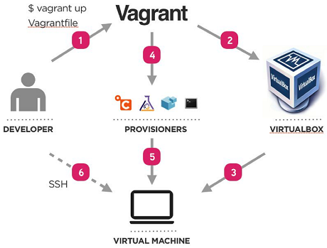

# Vagrant Box
Virtual machine for testing and developing using Python 2.7.x and 3.6.x.
Fully managed and provisioned using shell scripts.

## What is Vagrant
[Vagrant](https://www.vagrantup.com/docs/index.html) is an tool for building and managing virtual machine environments in an sigle workflow.

Provides easy to configure, reproducible and portable work environments built on top of industry-standard technology
and controlled by an single consistent workflow to help maximize the productivity and flexibility.

Vagrant has a concept of `providers` which map to the virtualisation engine and its API.
The most popular and well-supported provider is Virtualbox; plugins exist for `libvirt`, `kvm`, `lxc`, `vmware` and more

## Requirements:

### Intel VT-x virtualization
Many PC laptops (especially those from Lenovo, HP and Dell) have **Intel's VT-x virtualization**
turned off by default, which can cause issues with many Vagrant boxes. Enable VT-x in your system BIOS/UEFI settings.

### Linux OS
Use your distribution package manager and install the following `mandatory` packages:

- [VirtualBox](https://www.virtualbox.org/wiki/Downloads) `mandatory`
- [Vagrant](https://www.vagrantup.com/downloads.html) `mandatory`
- [Git](https://git-scm.com/book/en/v1/Getting-Started-Installing-Git) `mandatory`
- [SublimeText](http://docs.sublimetext.info/en/latest/getting_started/install.html) `optional`

### Windows OS
* Install (as Administrator) the Package Manager [Chocolatey](https://chocolatey.org/install)

The following `mandatory` packages must be installed through Chocolatey:

* [VirtualBox](https://chocolatey.org/packages/virtualbox) `mandatory`
* [Vagrant](https://chocolatey.org/packages/vagrant) `mandatory`
* [Cmder](https://chocolatey.org/packages/Cmder) or [Cygwin](https://chocolatey.org/packages/Cygwin) `mandatory`
* [Python3](https://chocolatey.org/packages/python3) `optional`
* [SublimeText](https://chocolatey.org/packages/SublimeText3) `optional`

Open Windows Cmd as Administrator:

```console
> cd path\to\VagrantFiles\main
> choco install files\chocolatey.config
> shutdown /r (Reboot Windows PC)
```

*In case of Windows 7 install the Powershell patch:*

* [Vagrant requires Powershell version 3 or later](https://stackoverflow.com/questions/1825585/determine-installed-powershell-version)
* [Install the patch Windows6.1-KB2506143-x64.msu](https://www.microsoft.com/en-us/download/details.aspx?id=34595)

## Vagrant Box

### Base Box
Based on Ubuntu `bionic/18.04` box from: [https://vagrantcloud.com/ubuntu/bionic64](https://vagrantcloud.com/ubuntu/bionic64)

### Ubuntu Packages
- build-essential
- software-properties-common
- language-pack-en
- git-core
- zip unzip
- vim
- ack-grep
- deborphan
- tree
- bash-completion
- libldap-2.4.2 ldap-utils
- lynx
- python-tk python3-tk
- graphviz
- dos2unix
- lsyncd
- docker

### Python Development Packages
- pip
- tox

### Preconfigured User Workspace Settings
- .vimrc
- .gitconfig
- .bash_profile
- .bash_aliases
- ipython_config.py
- .lsyncd.config.lua

## Installation
```console
git clone git@github.com:theodore86/TestVM.git
cd TestVM
export HTTPS_PROXY=ip_address:8080 (Linux host)
set HTTPS_PROXY=ip_address:8080 (Windows host)
vagrant up
vagrant ssh
```

## Project Structure
```bash
main
├── AUTHORS.md
├── CHANGELOG.md
├── CONTRIBUTING.md
├── docs (d)
├── lib (d)
├── provisioners (d)
├── README.md
├── files (d)
├── tox.ini
├── vagrant.yaml
├── Vagrantfile
└── .vagrantplugins
```

## Documentation

In order to serve locally and read the project documentation:
```console
tox -e docs
```

* ``docs``: The documentation
* ``lib``:  Vagrant helper modules
* ``provisioners``: Vagrant provisioners
* ``files``: Static files for the user workspace
* ``tox.ini``: Test command line tool
* ``vagrant.yaml``: Vagrant virtual machine central configuration file
* ``Vagrantfile``: Vagrant project file
* ``.vagrantplugins``: Vagrant plugins

## In a Nuschell

